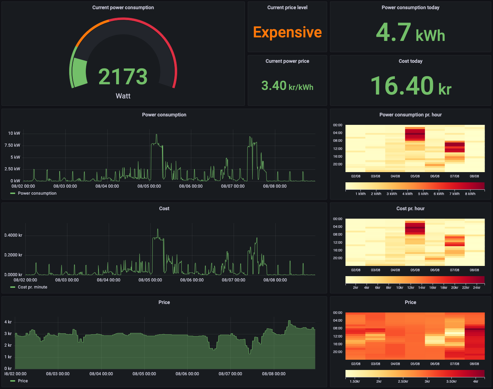
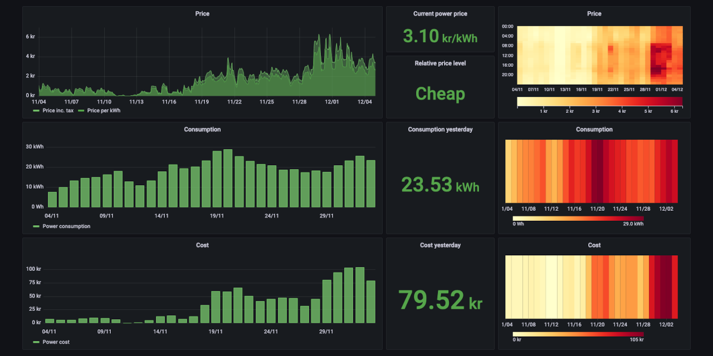

# Tibber prometheus exporter

Monitor your power usage and costs with Prometheus and Grafana.



## Description

This prometheus exporter will connect to the Tibber API, subscribe to updates from [Tibber Pulse](https://tibber.com/no/pulse) or [Watty](https://tibber.com/se/store/produkt/watty-tibber) and make the metrics available for Prometheus.

See the provided [Grafana dashboard](grafana/dashboard.json) for examples on how they can be used.  
Note that the consumption, cost and price heatmap panels requires the [Hourly heatmap plugin](https://grafana.com/grafana/plugins/marcusolsson-hourly-heatmap-panel/).

#### Don't have Tibber Pulse or Watty?

If you don't have a device for live measurements, only the power price metrics will be available on that dashboard. It is possible to create a dashboard with historic consumption and cost using the `..._previous_day` and `..._previous_hour` metrics, but the availability of those metrics may vary between grid companies. See the [dashboard without pulse](grafana/dashboard-without-pulse.json) for an example using the previous day metrics:




## Running

Docker image is available on [ghcr.io](https://github.com/terjesannum/tibber-exporter/pkgs/container/tibber-exporter).  
Prebuilt binaries for Linux, MacOS and Windows are available on the [release page](https://github.com/terjesannum/tibber-exporter/releases/latest).

A `TIBBER_TOKEN` is required to use the Tibber API, go to [developer.tibber.com](https://developer.tibber.com/) to find yours.

Regardless of how you run this program, it is important to run it with an automatic restart mechanism. If the live feed from Tibber for some reason is interrupted or not available, the program will take a short pause and exit. The pause is to avoid a restart loop and trigger rate limiting in the Tibber API, and just exiting and restarting is better than trying to handle every possible error situation.

The automatic restart on errors in the live feed will make the exporter recover from most error situations. However, there is a bug in the Tibber service which sometimes fails to report that a home has the live feed feature. To handle this situation, the exporter has a command line option `--live` that can be used to force the exporter to always start the live feed. Therefore, if you have the live feature for your home, it's recommended to run the exporter with `--live <home id>` to ensure that the live feed is always started.

### Docker compose

If you don't already run Grafana and Prometheus, you can try a complete setup with `docker compose`.

```sh
cd docker-compose
TIBBER_TOKEN=... docker compose up
```

Then go to http://localhost:3000/ and find the dashboards in the General folder.

### Kubernetes

Install in your kubernetes cluster with [Helm](https://helm.sh/). First add the the helm repository:

```
helm repo add tibber-exporter https://terjesannum.github.io/tibber-exporter/
helm repo update
```

Then install the helm chart:

```
helm install tibber-exporter tibber-exporter/tibber-exporter --set tibberToken=...
```

This with install the exporter with the `prometheus.io/scrape` annotation set to `true`. If you run the [Prometheus operator](https://github.com/prometheus-operator/prometheus-operator), install with `serviceMonitor.enabled=true` to create a `ServiceMonitor` instead:

```
helm install tibber-exporter tibber-exporter/tibber-exporter --set tibberToken=... --set serviceMonitor.enabled=true
```

### Docker container

```sh
docker run -d -p 8080:8080 -e TIBBER_TOKEN=... --restart always ghcr.io/terjesannum/tibber-exporter:latest
```

## Prometheus

Prometheus need to be configured to scrape the exporter, so add a scrape job to `/etc/prometheus/prometheus.yml`:
```
scrape_configs:

  - job_name: "tibber-exporter"
    scrape_interval: 5s
    static_configs:
      - targets: ["localhost:8080"]
```

How often the data is updated depends on your energy meter. Look at the logs from the exporter to see how often it receives updates, and adjust the scrape interval. Shorter scrape interval generates more data, so consider scraping less frequent if you only use a dashboard with a wide time range and don't need "live" updates.

Also remember that Prometheus is designed for monitoring and not precise calculation, so don't expect the result of the queries to excactly match your electricity bill.

## Grafana

Import the [dashboard](grafana/dashboard.json) or use id `16804` and import from [grafana.com](https://grafana.com/grafana/dashboards/16804-tibber/). Then select the Prometheus datasource that scrapes the exporter.

## Metrics

| Name                                     | Description                                          |
|------------------------------------------|------------------------------------------------------|
| tibber_home_info                         | Home info                                            |
| tibber_grid_info                         | Power grid info                                      |
| tibber_power_price                       | Current power price                                  |
| tibber_power_price_level                 | Current price level                                  |
| tibber_power_consumption                 | Current power consumption                            |
| tibber_power_consumption_day_avg         | Average power consumption today                      |
| tibber_power_consumption_day_min         | Minimum power consumption today                      |
| tibber_power_consumption_day_max         | Maximum power consumption today                      |
| tibber_power_consumption_day_total       | Total power consumption today                        |
| tibber_power_consumption_previous_hour   | Total power consumption previous hour                |
| tibber_power_consumption_previous_day    | Total power consumption yesterday                    |
| tibber_power_consumption_reactive        | Current reactive consumption                         |
| tibber_power_cost_day_total              | Total power cost today                               |
| tibber_power_cost_previous_hour_total    | Total power cost previous hour                       |
| tibber_power_cost_previous_day_total     | Total power cost yesterday                           |
| tibber_power_production                  | Current power production                             |
| tibber_power_production_day_min          | Minimum power production today                       |
| tibber_power_production_day_max          | Maximum power production today                       |
| tibber_power_production_day_total        | Total power production today                         |
| tibber_power_production_previous_day     | Total power production yesterday                     |
| tibber_power_production_reward_day_total | Total power production reward today                  |
| tibber_power_production_reactive         | Current net reactive production                      |
| tibber_power_factor                      | Current power factor (active power / apparent power) |
| tibber_power_profit_previous_day         | Total power profit yesterday                         |
| tibber_voltage                           | Phase voltage                                        |
| tibber_current                           | Line current                                         |
| tibber_signal_strength                   | Tibber Pulse signal strength                         |

More infomation can be found in the [Tibber API documentation](https://developer.tibber.com/docs/reference).

## Consider becoming a Tibber customer?

I would be happy if you use [this referral code](https://invite.tibber.com/qandobma). That will give each of us a bonus to use on stuff like Tibber Pulse :smile:

Or register the code `qandobma` directly in the app if you signed up without an invite.
